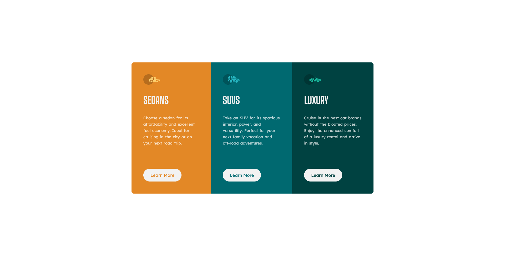

# Frontend Mentor - 3-column preview card component solution

This is a solution to the [3-column preview card component challenge on Frontend Mentor](https://www.frontendmentor.io/challenges/3column-preview-card-component-pH92eAR2-). Frontend Mentor challenges help you improve your coding skills by building realistic projects.

## Table of contents

- [Overview](#overview)
  - [The challenge](#the-challenge)
  - [Screenshot](#screenshot)
  - [Links](#links)
- [My process](#my-process)
  - [Built with](#built-with)
  - [What I learned](#what-i-learned)
  - [Continued development](#continued-development)
  - [Useful resources](#useful-resources)
- [Author](#author)

## Overview

### The challenge

Users should be able to:

- View the optimal layout depending on their device's screen size
- See hover states for interactive elements

### Screenshot



### Links

- Solution URL: [github](https://github.com/WidePeepoHappy/3-column-preview)
- Live Site URL: [github pages](https://widepeepohappy.github.io/3-column-preview/)

## My process

### Built with

- Semantic HTML5 markup
- Flexbox
- Mobile-first workflow
- SCSS

### What I learned

Starting to try implementing mixins and other features of SASS like nesting. Still learning:

```css
@mixin cardColor($color) {
  background-color: $color;

  &--btn {
    color: $color;
  }
}
```

Also changed the outline on buttons for a focus state. Learned that today from Kevin Powell on youtube:

```css
&__btn {
  text-decoration: none;
  background-color: hsl(0, 0%, 95%);
  padding: 12px 25px;
  font-size: 1.1em;
  border: 2px solid hsl(0, 0%, 95%);
  border-radius: 30px;
  outline: none;

  &:hover,
  &:focus {
    background-color: inherit;
    color: hsl(0, 0%, 95%);
  }
}
```

### Continued development

SASS seems easy, but there are a lot of ways to make code look cleaner. This and css clean css in general are my main focus for now.

### Useful resources

- ['5 CSS mistakes that I see way too often' by Kevin Powell](https://www.youtube.com/watch?v=iHEkRIF7zxI) - Learned about outline and of ways how not to repeat myself.

## Author

- Frontend Mentor - [@WidePeepoHappy](https://www.frontendmentor.io/profile/WidePeepoHappy)
